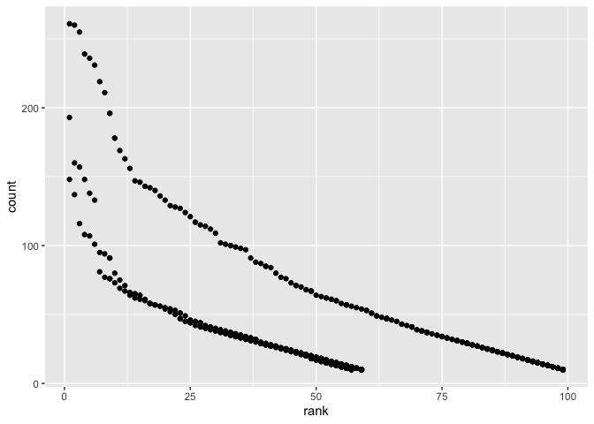

p8105\_hw2\_xc2472
================
Xing Chen
2019-10-1

# Problem 1

## Mr. Trash Wheel dataset

``` r
trashwheel_data = 
  read_excel(path = "./data/Trash-Wheel-Collection-Totals-8-6-19.xlsx", 
             sheet = "Mr. Trash Wheel", 
             range = "A2:N408")

trashwheel_data = janitor::clean_names(trashwheel_data)

trashwheel_data = drop_na(trashwheel_data, dumpster)

trashwheel_data = mutate(trashwheel_data, 
  sports_balls = round(sports_balls),
  sports_balls = as.integer(sports_balls)
)
```

## The precipitation dataset

import the datasets

``` r
prcp17_data = 
  read_excel(path = "./data/Trash-Wheel-Collection-Totals-8-6-19.xlsx",
             sheet = "2017 Precipitation",
             range = "A2:B14") %>% 
  janitor::clean_names()

prcp18_data = 
  read_excel(path = "./data/Trash-Wheel-Collection-Totals-8-6-19.xlsx",
             sheet = "2018 Precipitation",
             range = "A2:B14") %>% 
  janitor::clean_names()
```

omit rows without precipitation data and add a variable year

``` r
prcp17_data = drop_na(prcp17_data, total) %>% 
  mutate(year = 2017)

prcp18_data = drop_na(prcp18_data, total) %>% 
  mutate(year = 2018)
```

Combine the precipitation datasets and convert “month” variable to
character variable

``` r
prcp_combine_data = 
  bind_rows(prcp17_data, prcp18_data) %>% 
  mutate(
    month = month.name[month])
```

**Description**

# Problem 2

## read and clean the pols-month.csv

the frile plos\_month is read and cleaned.

the variable `mon` is separated into 3 variables, and the value in
`month` varriable is changed to character.

A president variable is created and drop the “day” variable

``` r
pols_month = 
  read_csv(file = "./data/fivethirtyeight_datasets/pols-month.csv") %>% 
  janitor::clean_names() %>% 
  separate(mon, into = c("year", "month", "day"), sep = "-") %>% 
  mutate(
    month = as.numeric(month),
    month = month.name[month]) %>% 
  pivot_longer(
    cols = starts_with("prez"),
    names_to = "president",
    names_prefix = "prez_",
    values_to = "times") %>% 
  filter(times != 0) %>% 
  select(-day)
```

    ## Parsed with column specification:
    ## cols(
    ##   mon = col_date(format = ""),
    ##   prez_gop = col_double(),
    ##   gov_gop = col_double(),
    ##   sen_gop = col_double(),
    ##   rep_gop = col_double(),
    ##   prez_dem = col_double(),
    ##   gov_dem = col_double(),
    ##   sen_dem = col_double(),
    ##   rep_dem = col_double()
    ## )

## read and clean the snp.csv

the file snp is read and cleaned.

the variable `date` is separated into 3 variables `year`, `month`, and
`day` then, the variable `day` is dropped and the dataset is arranged so
that `year` and `month` is leading the column, for consistency across
datasets.

``` r
snp = 
  read_csv(file = "./data/fivethirtyeight_datasets/snp.csv") %>% 
  janitor::clean_names() %>% 
  separate(date, into = c("month", "day", "year"), sep = "/") %>% 
  mutate(
    month = as.numeric(month),
    month = month.name[month]) %>% 
  select(year, month, -day, close) 
```

    ## Parsed with column specification:
    ## cols(
    ##   date = col_character(),
    ##   close = col_double()
    ## )

## read and clean the unemployment.csv

``` r
unemploy = 
  read_csv(file = "./data/fivethirtyeight_datasets/unemployment.csv", 
           col_types = "cdddddddddddd"
           ) %>% 
  janitor::clean_names() %>% 
  rename(Janurary = jan, feburary = feb, March = mar, April = apr, June = jun, 
         July = jul, August = aug, Septemper = sep, October = oct, November = nov, 
         December = dec) %>% 
  pivot_longer(
    Janurary:December,
    names_to = "month",
    values_to = "unemploy_rate")
```

## join the 3 datasets

``` r
problem2_join = left_join(pols_month, snp, by = c("year", "month"))
problem2_join = left_join(problem2_join, unemploy, by = c("year", "month"))
```

**description**

# Problem 3

## Import and clean the dataset

read and clean teh popular\_baby\_names datasets and change the
inconsistency values within the variable ethnicity

``` r
baby_names = 
  read_csv(file = "./data/Popular_Baby_Names.csv") %>% 
  janitor::clean_names() %>% 
  mutate(
    ethnicity = str_to_lower(ethnicity),
    ethnicity = replace(ethnicity, ethnicity == "asian and paci", "asian and pacific islander"),
    ethnicity = replace(ethnicity, ethnicity == "black non hisp", "black non hispanic"),
    ethnicity = replace(ethnicity, ethnicity == "white non hisp", "white non hispanic"),
    gender = str_to_lower(gender),
    childs_first_name = str_to_lower(childs_first_name)) %>% 
  distinct()
```

    ## Parsed with column specification:
    ## cols(
    ##   `Year of Birth` = col_double(),
    ##   Gender = col_character(),
    ##   Ethnicity = col_character(),
    ##   `Child's First Name` = col_character(),
    ##   Count = col_double(),
    ##   Rank = col_double()
    ## )

create a table indicating the rank of the name “Olivia” as a female baby
name over time, with rows for ethnicities and columns for year

``` r
olivia_female_rank = 
  baby_names %>% 
  filter(childs_first_name == "olivia", gender == "female") %>% 
  select(rank, year_of_birth, ethnicity) %>% 
  pivot_wider(
    names_from = "year_of_birth",
    values_from = "rank")
```

create a table indicating the popular name among male children, with
rows for ethnicities and columns for year

``` r
male_name = 
  baby_names %>% 
  filter(gender == "male") %>% 
  select(childs_first_name, rank, year_of_birth, ethnicity) %>% 
  filter(childs_first_name == "ethan") %>% 
  pivot_wider(
    names_from = "year_of_birth",
    values_from = "rank")
```

``` r
male_nonhispanic = 
  baby_names %>% 
  filter(gender == "male", ethnicity != "hispanic", year_of_birth == 2016)

ggplot(male_nonhispanic, aes(x = rank, y = count)) + geom_point()
```

<!-- -->
